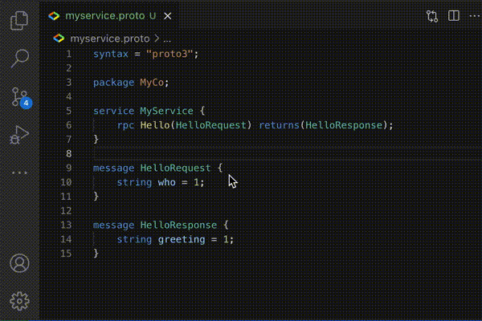

# API Linter

Run api-linter on your protocol buffer files.

## Features

## Requirements

Please make sure you have `api-linter` binary installed. If you do not have it, please follow the instructions [here](https://linter.aip.dev/#installation)
